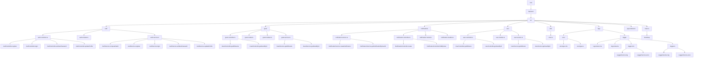

```mermaid
graph TD
  node0["root"]
  node1["backend"]
  node0 --> node1
  node2["src"]
  node1 --> node2
  node3["auth"]
  node2 --> node3
  node4["auth.controller.ts"]
  node3 --> node4
  node5["AuthController.register"]
  node4 --> node5
  node6["AuthController.login"]
  node4 --> node6
  node7["AuthController.setNewPassword"]
  node4 --> node7
  node8["AuthController.updateProfile"]
  node4 --> node8
  node9["auth.module.ts"]
  node3 --> node9
  node10["auth.service.ts"]
  node3 --> node10
  node11["AuthService.computeHatch"]
  node10 --> node11
  node12["AuthService.register"]
  node10 --> node12
  node13["AuthService.login"]
  node10 --> node13
  node14["AuthService.setNewPassword"]
  node10 --> node14
  node15["AuthService.updateProfile"]
  node10 --> node15
  node16["grant"]
  node2 --> node16
  node17["grant.controller.ts"]
  node16 --> node17
  node18["GrantController.getAllGrants"]
  node17 --> node18
  node19["GrantController.getGrantById"]
  node17 --> node19
  node20["grant.model.ts"]
  node16 --> node20
  node21["grant.module.ts"]
  node16 --> node21
  node22["grant.service.ts"]
  node16 --> node22
  node23["GrantService.getAllGrants"]
  node22 --> node23
  node24["GrantService.getGrantById"]
  node22 --> node24
  node25["notifications"]
  node2 --> node25
  node26["notifcation.service.ts"]
  node25 --> node26
  node27["NotificationService.createNotification"]
  node26 --> node27
  node28["NotificationService.getNotificationByUserId"]
  node26 --> node28
  node29["notification.controller.ts"]
  node25 --> node29
  node30["NotificationController.create"]
  node29 --> node30
  node31["NotificationController.findByUser"]
  node29 --> node31
  node32["notification.model.ts"]
  node25 --> node32
  node33["notification.module.ts"]
  node25 --> node33
  node34["user"]
  node2 --> node34
  node35["user.controller.ts"]
  node34 --> node35
  node36["UserController.getAllUsers"]
  node35 --> node36
  node37["UserController.getUserById"]
  node35 --> node37
  node38["user.module.ts"]
  node34 --> node38
  node39["user.service.ts"]
  node34 --> node39
  node40["UserService.getAllUsers"]
  node39 --> node40
  node41["UserService.getUserById"]
  node39 --> node41
  node42["utils"]
  node2 --> node42
  node43["error.ts"]
  node42 --> node43
  node44["tags"]
  node2 --> node44
  node45["error"]
  node44 --> node45
  node46["errortype.d.ts"]
  node45 --> node46
  node47["errortype.ts"]
  node45 --> node47
  node48["logger"]
  node44 --> node48
  node49["logcontext.d.ts"]
  node48 --> node49
  node50["logcontext.ts"]
  node48 --> node50
  node51["logger.d.ts"]
  node48 --> node51
  node52["LoggerService.log"]
  node51 --> node52
  node53["LoggerService.error"]
  node51 --> node53
  node54["logger.ts"]
  node48 --> node54
  node55["LoggerService.log"]
  node54 --> node55
  node56["LoggerService.error"]
  node54 --> node56
  node57["app.module.ts"]
  node2 --> node57
  node58["main.ts"]
  node2 --> node58
  node59["bootstrap"]
  node58 --> node59

```

Last Updated: November 21, 2024 @ 1:55PM